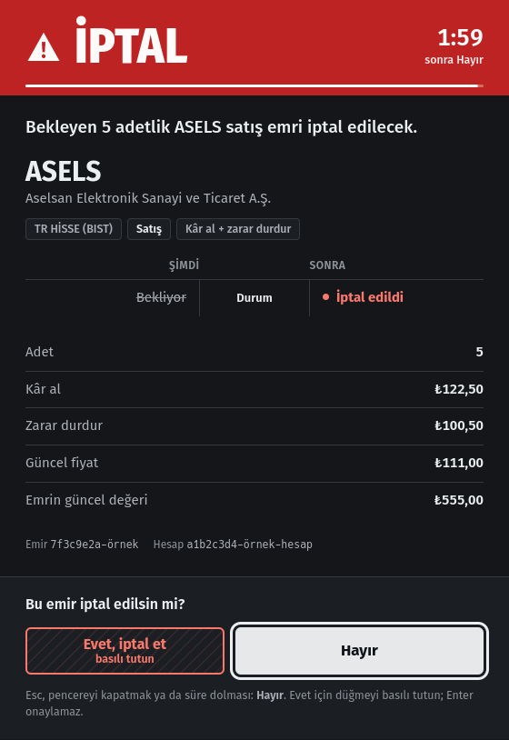
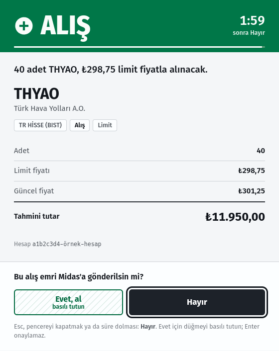

# mcp-midas

[English](README.en.md)

> [!WARNING]
> **Resmî değildir.** Bu proje Midas Menkul Değerler A.Ş. ya da Midas Finansal Teknolojiler
> A.Ş. ile bağlantılı değildir; onlar tarafından geliştirilmez, onaylanmaz, desteklenmez.
> "Midas" adı yalnızca hangi hizmetle çalıştığını söylemek için geçer; Midas logosu ve
> marka öğeleri kullanılmaz.
>
> **Yatırım tavsiyesi değildir.** Araçların döndürdüğü veri ve hesaplamalar (teknik
> göstergeler dahil) bilgi amaçlıdır. Yazılım olduğu gibi, hiçbir garanti olmadan sunulur.
>
> **Yalnız kendi hesabında, kendi riskinle.** Midas Genel Çerçeve Sözleşmesi m. 1.11'e göre
> müşteri, Midas'ın izni olmadan Elektronik İşlem Platformu'na üçüncü şahısların
> müdahalesine rıza gösteremez; sözleşme ayrıca platformun yalnızca müşterinin kendisi
> tarafından kullanılmasını ve şifrenin kimseyle paylaşılmamasını ister. Bu araç, hesap
> sahibinin kendi bilgisayarında kendi hesabı için çalıştırması içindir. **Başkasının
> hesabını yönetmek, başkası adına işlem yapmak ya da bunu hizmet olarak sunmak için
> kullanılmaz.** Sözleşmenin güncel hâlini kendin oku; bu not hukuki görüş değildir.
>
> **Kimlik bilgileri yalnız yerelde kalır.** Telefon, şifre ve oturum dosyası senin
> makinende durur; kod bunları yalnızca Midas'ın kendi giriş formuna gönderir.

Midas aracı kurumunun web uygulaması [Atlas](https://atlas.getmidas.com/) için bir
[MCP](https://modelcontextprotocol.io) sunucusu. Bir AI asistanın portföyünü, pozisyonlarını,
işlem geçmişini ve piyasa verisini okumasını sağlar. İstersen desteklenen emirleri
hazırlayıp güncelleyebilir ya da iptal edebilir; ama emir araçları **varsayılan kapalıdır**
ve açıkken de her emir masaüstünde senin onayını bekler.

Midas'ın herkese açık bir API'si yok. Sunucu Atlas web uygulamasını
[Playwright](https://playwright.dev) ile sürer: tek bir oturumlu tarayıcı tutar ve web
uygulamasının yaptığı GraphQL çağrılarını sayfanın içinden yapar, böylece oturum çerezleri
kendiliğinden eklenir. Belgelenmemiş iç uç noktalara dayandığı için Midas bir değişiklik
yaptığında haber vermeden bozulabilir.

## Araçlar

### Okuma araçları (her zaman açık)

| Araç | Argümanlar | Ne döner |
| --- | --- | --- |
| `get_portfolio` | – | TL cinsinden toplam değer, günlük kâr/zarar, hesap başına nakit ve alım gücü (TRY / USD / EUR) |
| `get_assets` | – | Açık pozisyonların hepsi: adet, ortalama maliyet, fiyat, piyasa değeri, kâr/zarar |
| `get_asset_price` | `symbol`, isteğe bağlı `currency` | Son fiyat, önceki kapanış, % değişim, seans durumu |
| `get_asset_info` | `symbol` | Enstrüman adı, pazar, açıklama, güncel fiyat ve Atlas enstrüman sayfası istatistikleri (TEFAS fonları: risk seviyesi, valör, vergi, yönetim ücreti; hisseler: günlük bant, 52 haftalık aralık, oranlar). `exactMatch` bulanık eşleşmeyi işaretler |
| `get_pending_orders` | `symbol?` | Bekleyen emirler; `symbol` verilmezse tüm hesaplardaki bekleyen emirler tek çağrıda |
| `get_transactions` | `from_date?`, `to_date?`, `status?`, `filter?`, `details?`, `limit?`, `offset?` | Hesap hareketleri (Atlas "İşlem geçmişi"): hisse/ETF/fon işlemleri, TL transferleri, döviz, nema, stopaj, temettü. Varsayılan: son 30 gün |
| `get_transaction_filters` | – | `get_transactions` için kullanılabilecek kategori kimlikleri |
| `get_technicals` | `symbol`, isteğe bağlı `interval` | RSI(14), SMA/EMA (20/50/200), MACD, Bollinger, ATR, yıllık oynaklık, 52 haftalık aralık, destek/direnç, hacim/ortalama |
| `get_chart` | `symbol`, isteğe bağlı `interval`, `limit` | Ham OHLCV mumları (en çok 500) |

BIST hisseleri, ABD hisseleri ve ETF'ler ve TEFAS fonları okunabilir; elinde olmayanlar dahil.

> **Okumada sembol çözümü bulanıktır.** Semboller arama ile bulunur ve bilinmeyen bir kod
> hata vermek yerine en yakın eşleşmeye düşer: `VOO` istenince `IOO` fonu, `TTE` istenince
> aynı kodlu Türk fonu yerine TotalEnergies dönebilir. Okuma yanıtında `name` ve `currency`
> alanlarını kontrol et. Emir araçları birebir sembol ister ve bulanık eşleşmeyi reddeder.

### Emir araçları (varsayılan kapalı)

| Araç | Argümanlar | Ne yapar |
| --- | --- | --- |
| `place_order` | birebir `symbol`, `side`, isteğe bağlı `order_type`, `quantity`, `amount_try`, `limit_price` | BIST hisse MARKET/LIMIT emri ve TEFAS fonu DEMAND satış emri |
| `update_order` | `order_id`, birebir `symbol`, değişen adet/fiyatlar | Bekleyen LIMIT/STOP/kâr al/zarar durdur emrini günceller |
| `cancel_order` | `order_id`, birebir `symbol` | Uygun bekleyen emri iptal eder |

TEFAS fon satışı `DEMAND` emri ve adetle desteklenir. Fon alımı şimdilik bilerek
reddedilir: isteğin TL tutarı mı adet mi taşıması gerektiği kanıtlanmadı, sunucu tahmin
etmez.

## Emir araçlarını açmak

Emir araçları yalnız şu ortam değişkeni **tam olarak `1`** ise kaydedilir:

```ini
MIDAS_ORDERS_ENABLED=1
```

Değişken yoksa (ya da `true`, `yes` gibi başka bir değerse) `place_order`, `update_order` ve
`cancel_order` MCP araç listesinde hiç görünmez; asistan bunları çağıramaz, varlıklarını da
bilmez. Bayrak yalnız araçların var olup olmadığını belirler. Açıkken de hiçbir emir onay
penceresi olmadan gönderilmez.

## Onay penceresi

Her emir aracı enstrümanı ve hesabı Midas'tan çözer, önizlemeyi bu güvenilir veriyle kurar
ve ardından MCP sunucusunun kendi sürecinde yerel bir onay penceresi açar:

- Tasarımlı pencere (`onay/onay.py`, PySide6 + QtWebEngine; önizleme stdin'den gelir, ağ
  erişimi yok). Açılamazsa `kdialog --menu`, o da açılamazsa `zenity`.
- Varsayılan cevap **Hayır**. **Evet** basılı tutularak verilir; Enter onaylamaz. Esc,
  pencereyi kapatmak ya da 120 saniye sessizlik Hayır demektir.
- Ekran yoksa, pencere programı yoksa ya da pencere hata verirse işlem yine reddedilir ama
  bu "onay penceresi açılamadı" hatası olarak bildirilir, kullanıcı reddi sayılmaz.
- Onaylar sıraya girer; aynı anda tek pencere görünür.

<p>
  
  
</p>

<sub>Ekran görüntüleri örnek veriyle çekildi; hesap ve emir kimlikleri gerçek değildir.</sub>

MCP arayüzünde `confirmed`, `approve` ya da onayı atlayan bir argüman, ortam değişkeni veya
ayar yoktur. Onaydan sonra sunucu sembolü ve güncel fiyatı yeniden çözer; enstrüman
değişmişse ya da fiyat %2'den fazla oynamışsa işlem iptal edilir. Ayrıca
`MAX_ORDER_VALUE_TRY` tavanı (varsayılan ₺10.000) vardır; bu tavan onayın yerine geçmez.
Her deneme ve sonucu `.midas-orders.log.jsonl` dosyasına 0600 izinle, kimlik bilgisine
benzeyen alanlar ayıklanarak yazılır.

Onay penceresi Linux masaüstü için yazıldı (PySide6 ve QtWebEngine sistem Python'unda;
yoksa `kdialog` ya da `zenity`). Pencere açılamayan bir ortamda emir araçları hiçbir emri
gönderemez.

## Kurulum

Node.js 20+ gerekir.

```bash
git clone https://github.com/YakupEmreYerli/mcp-midas.git
cd mcp-midas
npm ci
npx playwright install chromium
npm run build
```

### Kimlik bilgileri

Kimlik bilgilerini ortam değişkeniyle ver. Sunucu yalnızca `process.env` okur; ortam
değişkeni enjekte edebilen herhangi bir sır yöneticisi çalışır. En basit yol, gitignore'lu
bir `.env` dosyası:

```bash
cp .env.example .env
```

```ini
MIDAS_PHONE=5XXXXXXXXX      # ülke kodu olmadan cep telefonu
MIDAS_PASSWORD=sifren
HEADLESS=true
MAX_ORDER_VALUE_TRY=10000   # ek tavan; masaüstü onayı her zaman gerekir
# MIDAS_ORDERS_ENABLED=1    # emir araçlarını açar (varsayılan kapalı)
```

### Giriş

Midas girişte mobil uygulamada bir bildirim onayı ister, bu yüzden ilk giriş etkileşimlidir:

```bash
npm run login          # görünür tarayıcı açar; telefondaki bildirimi onayla
npm run smoke          # portföyü, pozisyonları ve bir fiyatı yazdırır
```

Sonrası sessizdir. Atlas kimliği `access_token` (~15 dk) ve `refresh_token` (~24 sa)
çerezlerinde tutar ve Chromium bunları profilin çerez veritabanına yazmaz; kalıcı profil tek
başına oturumu kaybeder. Bu yüzden oturum her başarılı açılıştan sonra Playwright
`storageState()` ile `.midas-state.json` dosyasına (0600, gitignore'lu) yazılır ve sonraki
açılışta geri yüklenir.

Sunucu yenileme çerezinin ömründen uzun süre kullanılmazsa kendi kendine yeniden giriş
yapar: başsız süreç giriş formunu tamamlamak için tarayıcıyı kısa süre görünür açar, sonra
başsız moda döner; bu giriş yine bildirim onayı isteyebilir. 401/403 alan bir okuma isteği
bu paylaşılan giriş akışından sonra bir kez yinelenir. Emir isteği asla otomatik yinelenmez:
başarısız olur ve yeni çağrı yeni bir masaüstü onayından geçer.

### MCP istemcisine ekleme

stdio:

```bash
claude mcp add midas -- node /mutlak/yol/mcp-midas/dist/index.js
```

JSON yapılandırması okuyan istemciler için:

```json
{
  "mcpServers": {
    "midas": {
      "command": "node",
      "args": ["/mutlak/yol/mcp-midas/dist/index.js"]
    }
  }
}
```

### Kalıcı HTTP servisi (isteğe bağlı)

`dist/http.js` sunucuyu `127.0.0.1:8766` üzerinde Streamable HTTP olarak çalıştırır; tarayıcı
oturumu açık kalır ve birden çok istemci aynı oturumu paylaşır. İstekler
`~/.config/mcp-midas/token` dosyasındaki (ilk açılışta 0600 izinle üretilir) bearer token
ile doğrulanır; `/health` doğrulama istemez. Port `MIDAS_HTTP_PORT`, token dosyası
`MIDAS_TOKEN_FILE` ile değişir. Örnek systemd kullanıcı servisi:

```ini
[Unit]
Description=Midas MCP (127.0.0.1:8766)
After=graphical-session.target
PartOf=graphical-session.target

[Service]
WorkingDirectory=/mutlak/yol/mcp-midas
# Emir araçlarını istiyorsan:
# Environment=MIDAS_ORDERS_ENABLED=1
ExecStart=/usr/bin/env node dist/http.js
Restart=on-failure

[Install]
WantedBy=graphical-session.target
```

Onay penceresi masaüstü ister; servis grafik oturumuna bağlı çalışmalıdır.

## Nasıl çalışır

`src/session.ts` kalıcı bir Chromium profili açar, girişi ve oturum anlık görüntüsünü
yönetir. Kimlik çerezle taşındığı için `src/api.ts` her GraphQL isteğini token akışını
yeniden yazmak yerine oturumlu sayfanın içinde `page.evaluate` ile çalıştırır.

Kolay gözden kaçan iki ayrıntı:

- API geçidi `x-midas-rid` başlığı ister. Web uygulamasının profil başına ürettiği sabit bir
  istek kimliğidir; oturum onu yeniden hesaplamaya çalışmak yerine uygulamanın kendi
  isteklerinden gözler.
- Geçit `x-apollo-operation-name` ile yönlendirir ve bu değer işlem adı değil **kök alan
  adı** olmalıdır. Belgenin ilk seçimi bir takma adsa gerçek alan adı açıkça verilir.

Başsız Chromium, normal bir user agent ve client hint'ler göstermezse 403 alır;
`session.ts` bunları ayarlar.

`scripts/` API'yi haritalamak için kullanılan araçları tutar (Midas değişirse diye):
`browser-daemon.ts` (CDP portlu, ağ kaydeden tarayıcı), `analyze.ts` (yakalanan GraphQL
trafiğini özetler), `dump-panel-bundles.ts` (tembel yüklenen paketleri indirir),
`extract-ops.ts` / `extract-document.ts` (sunucuda introspection kapalı olduğu için GraphQL
belgelerini küçültülmüş paketin gömülü AST'sinden çıkarır). Bu araçların ürettiği
`discovery/` klasörü hesap verisi içerebilir ve gitignore'ludur.

### Deneysel: BIST tarama kodu

Upstream'den gelen, BIST hisselerini puanlamak için nicel bir kural seti de depoda:
[`docs/analiz-kurallari.md`](docs/analiz-kurallari.md) (ajan için tam kurallar)
ve özeti [`METHOD.md`](METHOD.md). `src/` altındaki tarama, geriye dönük test ve konumlama
kodu (`backtest.ts`, `rescore.ts`, `positioning.ts`, `positions-scan.ts`, `snapshot.ts`,
`vwap.ts`, `inflation.ts`) bu kural setini uygular. **Deneysel ve doğrulanmamıştır**; kendi
geriye dönük testi dışında sınanmadı ve yatırım tavsiyesi değildir. MCP sunucusu bunlara
bağlı değildir.

## Geliştirme

```bash
npm test         # birim testleri (gerçek emir göndermez, Midas'a bağlanmaz)
npm run build
```

Geliştirme ve testte gerçek emir gönderilmez; kurallar [AGENTS.md](AGENTS.md) içinde.
Güvenlik bildirimi için [SECURITY.md](SECURITY.md).

## Kaynak ve lisans

Bu proje, Ahmet Deniz Yılmaz'ın
[ahmetdenizyilmaz/midas-mcp](https://github.com/ahmetdenizyilmaz/midas-mcp) deposundan
çatallandı. Çatallanma noktası upstream'in `a1bf39c` commit'idir ("Keep scan output out of
the repo", 3 Ağustos 2026); sonraki geliştirmeler bu depoda yapıldı.

Upstream deposunda ayrı bir `LICENSE` dosyası yoktur; lisans beyanı
[`package.json`](https://github.com/ahmetdenizyilmaz/midas-mcp/blob/a1bf39c/package.json)
içindeki `"license": "MIT"` alanı ve README'nin "License" bölümündedir. Bu depo aynı MIT
lisansıyla dağıtılır. [LICENSE](LICENSE) iki telif satırı taşır: özgün kod için Ahmet Deniz
Yılmaz, sonraki değişiklikler için Yakup Emre Yerli.
