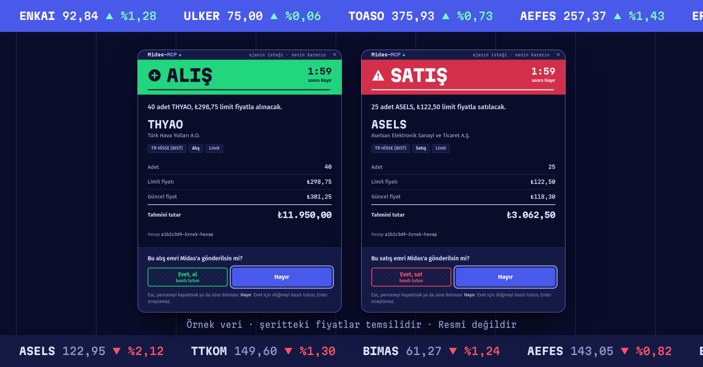
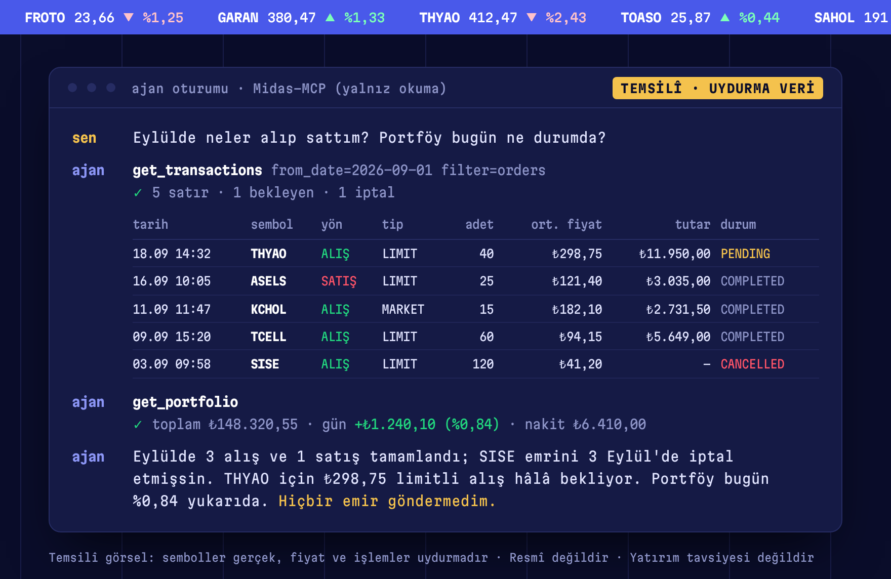
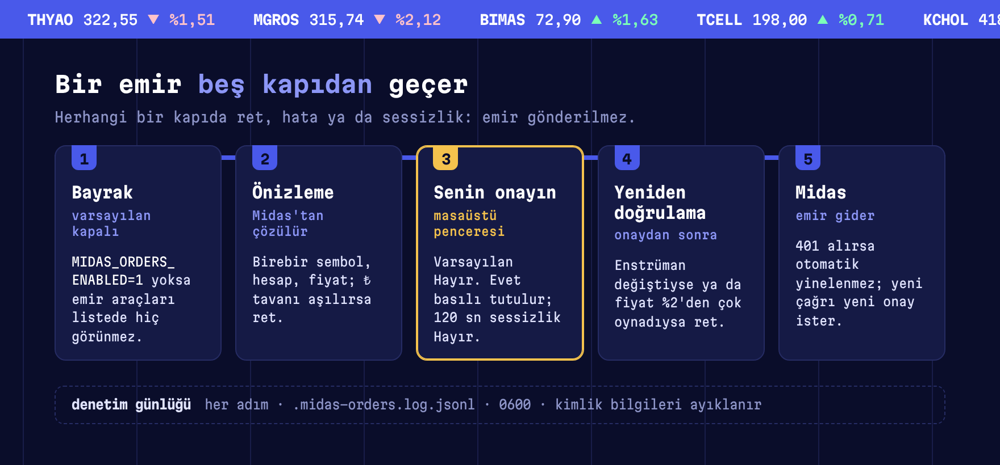
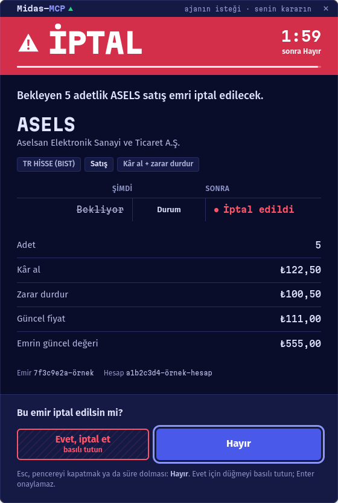
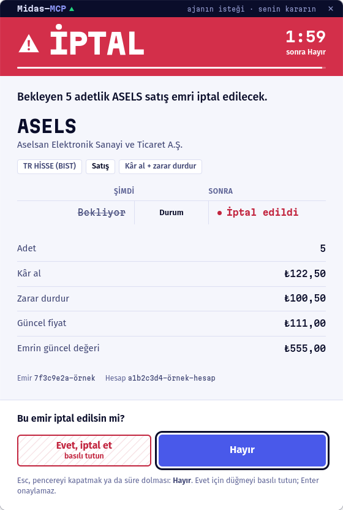

<h1>
  <picture>
    <source media="(prefers-color-scheme: dark)" srcset="docs/brand/yazi-koyu.svg">
    
  </picture>
</h1>

[](https://github.com/YakupEmreYerli/mcp-midas/actions/workflows/ci.yml) [](LICENSE) [](https://nodejs.org) [](#emir-araçlarını-açmak) [](#resmî-değildir)

**Ajan tahtayı okur, emri hazırlar. Emir, sen onaylamadan Midas'a gitmez.**

Midas aracı kurumunun web uygulaması [Atlas](https://atlas.getmidas.com/) için bir
[MCP](https://modelcontextprotocol.io) sunucusu. Bir AI asistanın portföyünü,
pozisyonlarını, işlem geçmişini ve piyasa verisini okumasını sağlar. Emir araçları
varsayılan kapalıdır; açıldığında da her emir masaüstünde senin onayını bekler.

> English: [README.en.md](README.en.md)



## Resmî değildir

> [!WARNING]
> **Resmî değildir.** Bu proje Midas Menkul Değerler A.Ş. ya da Midas Finansal Teknolojiler
> A.Ş. ile bağlantılı değildir; onlar tarafından geliştirilmez, onaylanmaz, desteklenmez.
> "Midas" adı yalnızca hangi hizmetle çalıştığını söylemek için geçer; Midas logosu ve
> marka öğeleri kullanılmaz.
>
> **Yatırım tavsiyesi değildir.** Araçların döndürdüğü veri ve hesaplamalar (teknik
> göstergeler dahil) bilgi amaçlıdır. Yazılım olduğu gibi, hiçbir garanti olmadan sunulur.
>
> **Yalnız kendi hesabında, kendi riskinle.** Midas Genel Çerçeve Sözleşmesi m. 1.11'e göre
> müşteri, Midas'ın izni olmadan Elektronik İşlem Platformu'na üçüncü şahısların
> müdahalesine rıza gösteremez; sözleşme ayrıca platformun yalnızca müşterinin kendisi
> tarafından kullanılmasını ve şifrenin kimseyle paylaşılmamasını ister. Bu araç, hesap
> sahibinin kendi bilgisayarında kendi hesabı için çalıştırması içindir. **Başkasının
> hesabını yönetmek, başkası adına işlem yapmak ya da bunu hizmet olarak sunmak için
> kullanılmaz.** Sözleşmenin güncel hâlini kendin oku; bu not hukuki görüş değildir.
>
> **Kimlik bilgileri yalnız yerelde kalır.** Telefon, şifre ve oturum dosyası senin
> makinende durur; kod bunları yalnızca Midas'ın kendi giriş formuna gönderir.

## Özellikler

- **Okuma araçları.** Portföy değeri, nakit ve alım gücü, açık pozisyonlar, anlık fiyat ve
  enstrüman bilgisi; BIST hisseleri, ABD hisse ve ETF'leri, TEFAS fonları, elinde olmayanlar
  dahil.
- **İşlem geçmişi.** Atlas'taki "İşlem geçmişi" ekranının tamamı: alış satışlar, TL ve döviz
  hareketleri, temettü, nema, stopaj; tarih, kategori ve duruma göre süzülür.
- **Teknik analiz.** RSI, hareketli ortalamalar, MACD, Bollinger, ATR, oynaklık, destek ve
  direnç tek çağrıda; ham OHLCV mumları ayrıca.
- **Masaüstü onay kapısı.** Emir araçları açıksa her emir, güncelleme ve iptal senin
  ekranında bir pencere açar. Varsayılan Hayır'dır; Evet basılı tutularak verilir.
- **Emirler varsayılan kapalı.** Bayrak verilmezse emir araçları asistanın araç listesinde
  hiç görünmez.
- **Kalıcı oturum.** Telefondaki bildirimi bir kez onaylarsın; oturum saklanır, düşerse
  sunucu tek bir giriş akışıyla kendini toparlar.
- **stdio ya da HTTP.** Doğrudan MCP istemcisine bağlanır ya da yerelde kalıcı bir servis
  olarak birden çok istemciye aynı oturumu paylaştırır.



## Kurulum

Gerekenler: Node.js 20+, Linux masaüstü (emir onayı için), Midas hesabı ve telefonundaki
Midas uygulaması.

**1. Klonla ve derle**

```bash
git clone https://github.com/YakupEmreYerli/mcp-midas.git
cd mcp-midas
npm ci
npx playwright install chromium
npm run build
```

**2. Kimlik bilgilerini ortamla ver**

Sunucu yalnızca `process.env` okur; ortam değişkeni enjekte edebilen herhangi bir sır
yöneticisi çalışır. En basit yol gitignore'lu bir `.env` dosyası:

```bash
cp .env.example .env
```

```ini
MIDAS_PHONE=5XXXXXXXXX      # ülke kodu olmadan cep telefonu
MIDAS_PASSWORD=sifren
HEADLESS=true
MAX_ORDER_VALUE_TRY=10000   # ek tavan; masaüstü onayı her zaman gerekir
# MIDAS_ORDERS_ENABLED=1    # emir araçlarını açar (varsayılan kapalı)
```

**3. İlk giriş**

Midas girişte mobil uygulamada bildirim onayı ister, bu yüzden ilk giriş etkileşimlidir:

```bash
npm run login          # görünür tarayıcı açar; telefondaki bildirimi onayla
npm run smoke          # portföyü, pozisyonları ve bir fiyatı yazdırır
```

Oturum `.midas-state.json` dosyasına (0600, gitignore'lu) yazılır ve sonraki açılışlarda
geri yüklenir. Yenileme çerezinin ömrü (~24 saat) dolarsa sunucu kendi kendine yeniden
giriş yapar; bu giriş yine bildirim onayı isteyebilir.

**4. MCP istemcisine ekle**

```bash
claude mcp add midas -- node /mutlak/yol/mcp-midas/dist/index.js
```

JSON yapılandırması okuyan istemciler için:

```json
{
  "mcpServers": {
    "midas": {
      "command": "node",
      "args": ["/mutlak/yol/mcp-midas/dist/index.js"]
    }
  }
}
```

**5. (İsteğe bağlı) Kalıcı HTTP servisi**

`dist/http.js` sunucuyu `127.0.0.1:8766` üzerinde Streamable HTTP olarak çalıştırır;
tarayıcı oturumu açık kalır ve birden çok istemci aynı oturumu paylaşır. `/mcp` istekleri
`~/.config/mcp-midas/token` dosyasındaki (ilk açılışta 0600 izinle üretilir) bearer token
ile doğrulanır; `/health` doğrulama istemez. Port `MIDAS_HTTP_PORT`, token dosyası
`MIDAS_TOKEN_FILE` ile değişir. Örnek systemd kullanıcı servisi
(`~/.config/systemd/user/midas-mcp.service`):

```ini
[Unit]
Description=Midas MCP (127.0.0.1:8766)
After=graphical-session.target
PartOf=graphical-session.target

[Service]
WorkingDirectory=/mutlak/yol/mcp-midas
# Emir araçlarını istiyorsan:
# Environment=MIDAS_ORDERS_ENABLED=1
ExecStart=/usr/bin/env node dist/http.js
Restart=on-failure

[Install]
WantedBy=graphical-session.target
```

```bash
systemctl --user enable --now midas-mcp.service
```

Onay penceresi masaüstü ister; servis grafik oturumuna bağlı çalışmalıdır. Wayland
oturumunda pencere yerel Wayland penceresi olarak açılır (Wayland açılamazsa XWayland/X11'e
düşer; `MIDAS_ONAY_X11=1` X11'i zorlar). KDE Plasma'da KWin'e geçici bir betik yüklenir:
betik yalnız onay sürecinin penceresini üstte tutar ve ekranın ortasına alır; KWin yoksa bu
adım atlanır. Pencere simgesinin masaüstünde Midas-MCP logosu olarak görünmesi için bir kez:

```bash
onay/masaustu-kur.sh          # ~/.local/share/applications/midas-mcp-onay.desktop (+ simge)
onay/masaustu-kur.sh --kaldir # geri almak için
```

### Emir araçlarını açmak

Emir araçları yalnız şu ortam değişkeni **tam olarak `1`** ise kaydedilir:

```ini
MIDAS_ORDERS_ENABLED=1
```

Değişken yoksa (ya da `true`, `yes` gibi başka bir değerse) `place_order`, `update_order`
ve `cancel_order` MCP araç listesinde hiç görünmez; asistan bunları çağıramaz,
varlıklarını da bilmez. Bayrak yalnız araçların var olup olmadığını belirler. Açıkken de
hiçbir emir onay penceresi olmadan gönderilmez.

## Araçlar

### Okuma (her zaman açık)

| Araç | Argümanlar | Ne döner |
| --- | --- | --- |
| `get_portfolio` | – | TL cinsinden toplam değer, günlük kâr/zarar, hesap başına nakit ve alım gücü (TRY / USD / EUR) |
| `get_assets` | – | Açık pozisyonların hepsi: adet, ortalama maliyet, fiyat, piyasa değeri, kâr/zarar |
| `get_asset_price` | `symbol`, isteğe bağlı `currency`, `market` | Son fiyat, önceki kapanış, % değişim, seans durumu |
| `get_asset_info` | `symbol`, isteğe bağlı `market` | Enstrüman adı, pazar, açıklama, güncel fiyat ve Atlas istatistikleri (TEFAS: risk, valör, vergi, yönetim ücreti; hisse: günlük bant, 52 haftalık aralık, oranlar). `exactMatch` bulanık eşleşmeyi işaretler |
| `get_pending_orders` | `symbol?`, `market?` | Bekleyen emirler; `symbol` verilmezse tüm hesaplardakiler tek çağrıda |
| `get_transactions` | `from_date?`, `to_date?`, `status?`, `filter?`, `details?`, `limit?`, `offset?` | Hesap hareketleri: hisse/ETF/fon işlemleri, TL transferleri, döviz, nema, stopaj, temettü. Varsayılan: son 30 gün |
| `get_transaction_filters` | – | `get_transactions` için kategori kimlikleri |
| `get_technicals` | `symbol`, isteğe bağlı `interval`, `market` | RSI(14), SMA/EMA (20/50/200), MACD, Bollinger, ATR, yıllık oynaklık, 52 haftalık aralık, destek/direnç, hacim/ortalama |
| `get_chart` | `symbol`, isteğe bağlı `interval`, `limit`, `market` | Ham OHLCV mumları (en çok 500) |

> **Okumada sembol çözümü bulanıktır.** Semboller arama ile bulunur ve bilinmeyen bir kod
> hata vermek yerine en yakın eşleşmeye düşer: `VOO` istenince `IOO` fonu, `TTE` istenince
> aynı kodlu Türk fonu yerine TotalEnergies dönebilir. Yanıttaki `name` ve `currency`
> alanlarını kontrol et. Emir araçları birebir sembol ister ve bulanık eşleşmeyi reddeder.
>
> **Aynı sembolü birden çok enstrüman taşıyabilir** (ör. `GTM`: bir TEFAS fonu ve NASDAQ'taki
> ZoomInfo). Bu durumda önce pozisyonundaki enstrüman seçilir; pozisyon ayırt etmiyorsa okuma
> araçları Midas'ın ilk birebir eşleşmesini döner ve yanıtta `ambiguousSymbol` ile `candidates`
> listesini verir, isteğe bağlı `market` (`TR` ya da `US`) ipucuyla diğeri seçilir. Emir
> araçları bu durumda tahmin yapmaz: adayları (ad, piyasa, ülke, tip) listeleyerek reddeder.
> Güncelleme ve iptalde emrin kendi enstrümanı esas alınır.

### Emir (varsayılan kapalı)

| Araç | Argümanlar | Ne yapar |
| --- | --- | --- |
| `place_order` | birebir `symbol`, `side`, isteğe bağlı `order_type`, `quantity`, `amount_try`, `limit_price`, `take_profit_price`, `stop_loss_price` | BIST hisse MARKET/LIMIT emri, eldeki BIST hissesi için kâr al/zarar durdur satış emri (`TAKE_PROFIT_AND_STOP_LOSS`, `TAKE_PROFIT`, `STOP_LOSS`) ve TEFAS fonu DEMAND satış emri |
| `update_order` | `order_id`, birebir `symbol`, değişen adet/fiyatlar | Bekleyen LIMIT/STOP/kâr al/zarar durdur emrini günceller; Midas izin vermiyorsa (`showUpdate: false`) iptal edip yeniden girme yolunu söyler |
| `cancel_order` | `order_id`, birebir `symbol` | Uygun bekleyen emri iptal eder |

TEFAS fon satışı `DEMAND` emri ve adetle desteklenir. Fon alımı şimdilik bilerek reddedilir:
isteğin TL tutarı mı adet mi taşıması gerektiği kanıtlanmadı, sunucu tahmin etmez.

Midas mevcut kâr al/zarar durdur emirlerinde güncellemeye izin vermez (`showUpdate: false`).
Fiyatları değiştirmek için emri `cancel_order` ile iptal et, sonra `place_order` ile
`side: "SELL"`, `quantity`, `take_profit_price` ve `stop_loss_price` vererek yeniden gir. İki
adım ayrı onay ister; aradaki sürede pozisyon korumasızdır. İstek alanları Atlas web
paketindeki kâr al/zarar durdur satış formunun gönderdiğiyle aynıdır.

## Güvenlik



- **Onay penceresi.** Her emir aracı enstrümanı ve hesabı Midas'tan çözer, önizlemeyi bu
  veriyle kurar ve MCP sunucusunun kendi sürecinde yerel bir pencere açar: tasarımlı
  pencere (`onay/onay.py`, PySide6 + QtWebEngine, önizleme stdin'den, ağ erişimi yok);
  açılamazsa `kdialog --menu`, o da açılamazsa `zenity`.
- **Varsayılan Hayır.** Evet basılı tutularak verilir; Enter onaylamaz. Esc, pencereyi
  kapatmak ya da 120 saniye sessizlik Hayır demektir. Onaylar sıraya girer; aynı anda tek
  pencere görünür.
- **Hata ret değildir.** Ekran yoksa ya da pencere açılamazsa işlem yine reddedilir ama bu
  "onay penceresi açılamadı" hatası olarak bildirilir, kullanıcı reddi sayılmaz.
- **Atlatma kanalı yok.** MCP arayüzünde `confirmed`, `approve` ya da onayı atlayan bir
  argüman, ortam değişkeni veya ayar yoktur.
- **Onaydan sonra yeniden doğrulama.** Sunucu sembolü ve güncel fiyatı yeniden çözer;
  enstrüman değişmişse ya da fiyat %2'den fazla oynamışsa işlem iptal edilir.
  `MAX_ORDER_VALUE_TRY` tavanı (varsayılan ₺10.000) ek bir sınırdır, onayın yerine geçmez.
  Emir isteği 401 alırsa otomatik yinelenmez; yeni çağrı yeni onay ister.
- **Denetim günlüğü.** Her deneme ve sonucu `.midas-orders.log.jsonl` dosyasına 0600
  izinle, kimlik bilgisine benzeyen alanlar ayıklanarak yazılır; hangi pencerenin açıldığı
  da kaydedilir.

<p>
  
  
</p>

<sub>Pencereler örnek veriyle çekildi; hesap ve emir kimlikleri gerçek değildir.</sub>

Onay penceresi Linux masaüstü için yazıldı. Pencere açılamayan bir ortamda emir araçları
hiçbir emri gönderemez. Hassas dosyalar, kapsam ve açık bildirme yolu:
[SECURITY.md](SECURITY.md).

## Nasıl çalışır

Midas'ın herkese açık bir API'si yok. Sunucu Atlas web uygulamasını
[Playwright](https://playwright.dev) ile sürer: tek bir oturumlu tarayıcı tutar ve web
uygulamasının yaptığı GraphQL çağrılarını sayfanın içinden (`page.evaluate`) yapar;
oturum çerezleri kendiliğinden eklenir. Belgelenmemiş iç uç noktalara dayandığı için
Midas bir değişiklik yaptığında haber vermeden bozulabilir.

Atlas kimliği `access_token` (~15 dk) ve `refresh_token` (~24 sa) çerezlerinde tutar ve
Chromium bunları profile yazmaz; bu yüzden oturum her başarılı açılıştan sonra
`storageState()` ile saklanır. 401/403 alan bir okuma isteği paylaşılan giriş akışından
sonra bir kez yinelenir. Geçidin istediği `x-midas-rid` ve `x-apollo-operation-name`
başlıkları gibi ayrıntılar [CONTRIBUTING.md](CONTRIBUTING.md) içindeki "Depoya özgü
tuzaklar" bölümünde.

`scripts/` API'yi haritalamak için kullanılan araçları tutar (Midas değişirse diye); bu
araçların ürettiği `discovery/` klasörü hesap verisi içerebilir ve gitignore'ludur.

**Deneysel BIST tarama kodu.** Upstream'den gelen nicel kural seti
([`docs/analiz-kurallari.md`](docs/analiz-kurallari.md), özeti [`METHOD.md`](METHOD.md))
ve onu uygulayan tarama, geriye dönük test ve konumlama kodu (`src/backtest.ts`,
`rescore.ts`, `positioning.ts`, `positions-scan.ts`, `snapshot.ts`, `vwap.ts`,
`inflation.ts`) depodadır. Doğrulanmamıştır, yatırım tavsiyesi değildir; MCP sunucusu
bunlara bağlı değildir.

## Belgeler

| Belge | Ne anlatır |
| --- | --- |
| [METHOD.md](METHOD.md) | BIST tarama yönteminin tek sayfalık özeti |
| [docs/analiz-kurallari.md](docs/analiz-kurallari.md) | Ajanın tarama ve puanlamada uyduğu tam kural seti |
| [docs/brand](docs/brand/README.md) | Marka kiti: logo, renkler, yazı, üslup, Midas'la ilişki |
| [CONTRIBUTING.md](CONTRIBUTING.md) | Kurulum, gönderim öncesi komutlar, depoya özgü tuzaklar |
| [SECURITY.md](SECURITY.md) | Güvenlik açığı bildirimi, hassas dosyalar, alınmış önlemler |
| [DESIGN.md](DESIGN.md) | Onay penceresinin tasarım sistemi |

## Geliştirme

```bash
npm test         # birim testleri; Midas'a bağlanmaz, gerçek emir göndermez
npm run build
```

Geliştirme ve testte gerçek emir gönderilmez; ajan kuralları [AGENTS.md](AGENTS.md)
içinde.

## Kaynak ve lisans

Bu proje, Ahmet Deniz Yılmaz'ın
[ahmetdenizyilmaz/midas-mcp](https://github.com/ahmetdenizyilmaz/midas-mcp) deposundan
çatallandı. Çatallanma noktası upstream'in `a1bf39c` commit'idir ("Keep scan output out of
the repo", 3 Ağustos 2026); sonraki geliştirmeler bu depoda yapıldı.

Upstream deposunda ayrı bir `LICENSE` dosyası yoktur; lisans beyanı
[`package.json`](https://github.com/ahmetdenizyilmaz/midas-mcp/blob/a1bf39c/package.json)
içindeki `"license": "MIT"` alanı ve README'nin "License" bölümündedir. Bu depo aynı MIT
lisansıyla dağıtılır. [LICENSE](LICENSE) iki telif satırı taşır: özgün kod için Ahmet Deniz
Yılmaz, sonraki değişiklikler için Yakup Emre Yerli. Marka öğeleri ve yazı tipi lisansları
[docs/brand](docs/brand/README.md) içinde.
